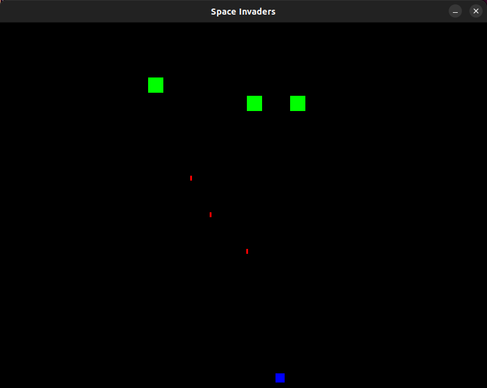

# Space Invaders Project

## Requirements
- [Python 3](https://wiki.python.org/moin/BeginnersGuide/Download)
- [Pygame](https://www.pygame.org/wiki/GettingStarted)

After installing above, run spaceinvaders.py via python3.
Move player with left and right arrow keys.
Fire with spacebar.
When you win or lose, restart with any key press.

### Description

Self-imposed project to create a space-invader-like game which features the following (but not all):
- Collision detection
- Increasing difficulty
- Enemy generator and spawner

### Notes

Most of the game is done from scratch with most of the shapes drawn by the pygame module.
The "aliens" do overlap and pass through each other in different directions; While in the original arcade game the aliens would move together in a grid and change directions, I've let them move independently in this version.
The enemy generator spawns 10 "aliens" per row depending on the difficulty in random 'x' coordinates which means they can overlap.
If you wanted to you could implement a check to ensure no aliens spawn on top each other but this is just a simple write-up.
